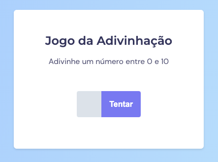

<h1 align="center">
  Jogo da advinhação ❓
</h1>

  <a href="#-tecnologias">Tecnologias</a>&nbsp;&nbsp;&nbsp;|&nbsp;&nbsp;&nbsp;
  <a href="#-projeto">Projeto</a>&nbsp;&nbsp;&nbsp;|&nbsp;&nbsp;&nbsp;
  <a href="#-layout">Layout</a>&nbsp;&nbsp;&nbsp;|&nbsp;&nbsp;&nbsp;
  <a href="#memo-licença">Licença</a>

  

## 🚀 Tecnologias

Esse projeto foi desenvolvido com as seguintes tecnologias:

- HTML
- CSS
- JavaScript

## 💻 Projeto

Jogo de advinhação de números. Escolha números aleatórios entre 0 a 10, tente advinha no mínimo de tentativas possíveis, a aplicação informrá o números de tentativas

## 🔖 Layout

Você pode visualizar o layout do projeto através [desse link](https://www.figma.com/file/5ULRN89682cnvQrdjsSg1B/Jogo-Adivinhação-(Copy)?node-id=0%3A1&t=ob1v8x2XtMQbjjEN-0). É necessário ter conta no [Figma](https://figma.com) para acessá-lo.

## :memo: Licença

Esse projeto está sob a licença MIT. Veja o arquivo [LICENSE](LICENSE.md) para mais detalhes.

---

Feito por Alan Rehfeldt :wave: 
